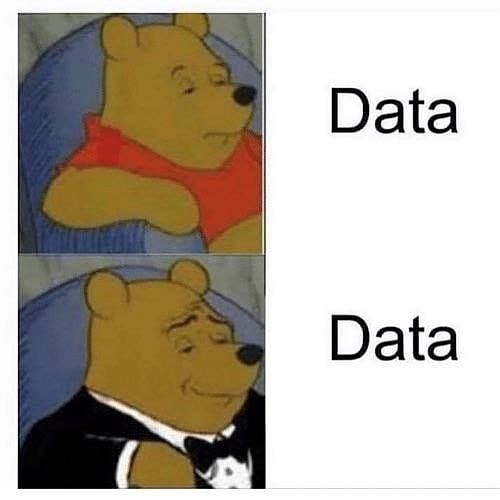

# coneScenes dataset

This repository contains the coneScenes dataset cli and tools for processing and editing the dataset.

## Dataset

## Tools
The repository consists of two primary scripts:

1. **Data Generation Script**: Use this script to process recordings from the car's LiDAR sensor and generate data suitable for deep learning tasks.

2. **Bounding Box Editing Script**: This script allows you to edit and refine the bounding boxes associated with cones in the dataset.

## Usage

### Data Generation

### Bounding Box Editing
